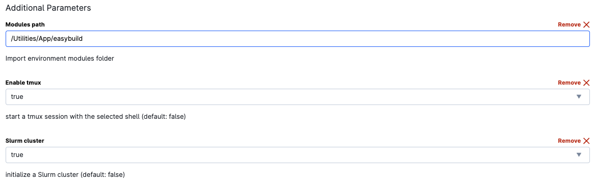

# Overview
This bash script is designed for running a ATAC-seq alignment on a SLURM cluster. The pipeline includes read alignment using BWA sampe, post-processing with SAMtools and Picard. Optionally it can trim fastq files using AdapterRemoval v2 and align the trimmed fastq files. 

# Prerequisites
* SLURM scheduler
*	Modules: BWA, SAMtools, picard, AdapterRemoval
*	Reference genomes (provided in /work/References)

# Usage

1. Modify SLURM Parameters (Optional): 
    Open the script (**pe_align_BWA_sampe_multigenome.sh**) and modify SLURM parameters at the beginning of the file, such as account, output file, email notifications, nodes, memory, CPU cores, and runtime. Alternatively, you can modify these parameters on-the-fly when executing the script.

2. On UCloud, start a **Terminal Ubuntu** run: 
   * Enable **Slurm cluster** 
   * * To process several samples consider requesting nodes > 1
   * Set the modules path to
    **FGM \> Utilities \> App \> easybuild**

    

   * Include the References folder
  **FGM \> References \> References**

    

   * Include your Scripts folder and the folder with the fastq.gz files.

   * **Notes:** 
     + Make sure the scripts have executing permission. If not run: `chmod 700 script.sh`
     + Match the job CPUs to the amounts requested in the script.
     + If you modify the memory parameter in the script, specify 5-10% less than the memory available in the terminal run.
     + Although it is not necessary to enable **tmux**, it is a good practise to always do it.

3. **Run the Script:** Submit the script to the SLURM cluster:

    ```
    sbatch -J <job_name> path_to/Scripts_folder/pe_align_BWA_sampe_multigenome.sh -g <mm10|mm39|hg38> <input-R1_001.fastq.gz-file> -t 
    ```

    **Required arguments**
    * **-g:** specify the genome to use (mm10, mm39, or hg38).
    * Replace **input-R1_001.fastq.gz-file** with the full path to your input FASTQ file (R1).
    
    **Optional argument parsing**
    * **-t:** perform trimming previously to the alignement. This is highly recommended for ATAC-seq samples.

    For several samples you can use a for loop:  

    ```
    for i in *R1_001.fastq.gz; do sbatch -J <job_name> path_to/Scripts_folder/pe_align_BWA_sampe_multigenome.sh -g <mm10|mm39|hg38> $i -t; sleep 1; done
    ```

4.	**Monitor Job:** You can monitor the job using the SLURM commands, such as squeue, scontrol show job <job-id>, and check the log files generated.

# Output
The script generates various output files, including aligned BAM files and log files.

**Notes:**  
   - Ensure that the necessary modules are available on your cluster.  
   -  The script includes Slurm directives to specify resource requirements. Review and customize the script based on your specific requirements.  
   -  For additional information on individual tools and parameters, refer to the documentation for BWA, SAMtools and Picard.
  
